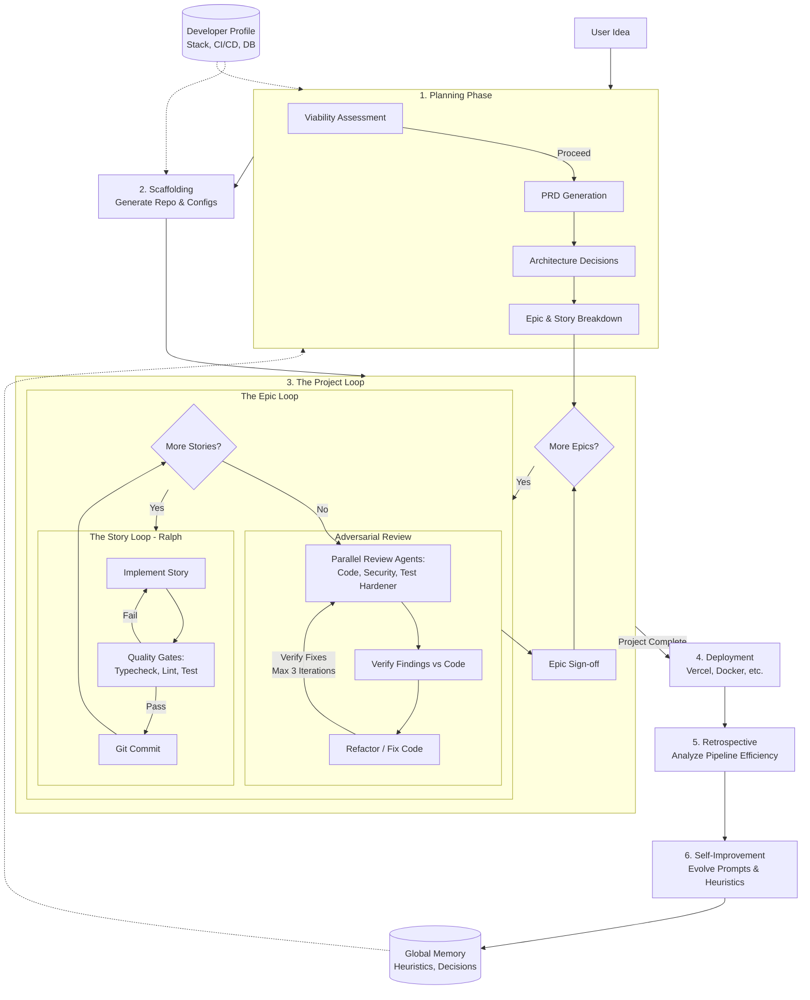

# BOOP

An opinionated, idea-to-software pipeline. Give Boop an idea. He plans it, architects it, builds it, tests it, reviews it, and hardens it. You steer the vision; he does the work.

Built on [OpenClaw](https://github.com/openclaw/openclaw) (agent runtime), [BMAD](https://github.com/bmadcode/BMAD-METHOD) (planning knowledge), and [Ralph](https://github.com/snarktank/ralph) (autonomous execution loop).

## How It Works

Boop chains three systems into a single automated pipeline:

1. **Planning** — Viability assessment, PRD, architecture decisions, and epic/story breakdown. Uses tested prompt templates derived from BMAD methodology, augmented with lessons learned from past projects.
2. **Building** — Autonomous agent loop picks up stories one at a time, implements, runs quality gates (typecheck + lint + test), and commits. One story per iteration, one epic at a time.
3. **Reviewing** — After each epic, a team of review agents runs in parallel: code reviewer, security scanner, and test hardener. Findings are verified against real code, then a fixer agent patches issues. The loop runs up to 3 iterations.
4. **Learning** — After every project, Boop runs a retrospective, captures architecture decisions, consolidates heuristics, and optionally evolves its own prompts. The next project benefits from what this one taught it.

The whole thing is wrapped in nested loops:



<details>
<summary>Text version (for terminals)</summary>

```
┌─ PROJECT LOOP ──────────────────────────────────────────────┐
│  idea → viability → plan → build → deploy → retrospective   │
│                                    ↓                         │
│                            self-improvement                  │
│                     (evolve prompts & heuristics)            │
│                                                              │
│  ┌─ EPIC LOOP ───────────────────────────────────────────┐  │
│  │  stories complete →                                    │  │
│  │  code review + security scan + test hardener →         │  │
│  │  verify findings + fix code (up to 3 iterations) →    │  │
│  │  sign-off                                              │  │
│  │                                                        │  │
│  │  ┌─ STORY LOOP ────────────────────────────────────┐  │  │
│  │  │  pick story → implement → typecheck → test →     │  │  │
│  │  │  commit → next story                             │  │  │
│  │  └─────────────────────────────────────────────────┘  │  │
│  └────────────────────────────────────────────────────────┘  │
└──────────────────────────────────────────────────────────────┘
```

</details>

Pipeline state is persisted to `.boop/state.yaml` after every transition. If the process dies, `npx boop --resume` picks up exactly where it left off.

## Prerequisites

- **Node.js 22+**
- **pnpm**
- **Docker** (optional, for agent sandboxing via `--sandbox`)
- **Git**
- **Claude API key** (`ANTHROPIC_API_KEY` environment variable)

## Quick Start

```bash
# Clone and install
git clone https://github.com/gtdrag/boop.git
cd boop
pnpm install

# Set your API key
export ANTHROPIC_API_KEY=sk-ant-...

# Run it
npx boop "I want an app that tracks vinyl records"
```

First run, Boop detects no developer profile and walks you through onboarding:

```
Hey, I'm Boop. Let's get to know each other.

Name?                  > George
Languages?             > TypeScript, Python
Frontend framework?    > Next.js
Backend framework?     > Express
Database?              > PostgreSQL
Deployment?            > Vercel
Styling?               > Tailwind
Test runner?           > Vitest
CI/CD?                 > GitHub Actions
...
```

This generates `~/.boop/profile.yaml` — your developer profile. Done once, used forever, editable with `npx boop --profile`.

Every project Boop builds will use your profile: the right framework, your preferred linter, your CI provider, your cloud target. No more boilerplate decisions.

## CLI

```bash
npx boop "your idea"        # Full pipeline from idea to software
npx boop                    # Interactive mode (prompts for idea)
npx boop --profile          # Edit your developer profile
npx boop --status           # Check current pipeline state
npx boop --review           # Review and sign off on latest epic
npx boop --resume           # Resume an interrupted pipeline
npx boop --autonomous       # Run without sign-off gates
npx boop --sandbox          # Run build agents in Docker containers

# Benchmarking
npx boop benchmark run [suite]          # Run a benchmark suite (default: smoke)
npx boop benchmark run smoke --dry-run  # Dry-run with mock responses (free, fast)
npx boop benchmark run smoke --live     # Live run with real Claude API (costs money)
npx boop benchmark run smoke --json     # Output raw JSON to stdout
npx boop benchmark list                 # List available suites
npx boop benchmark list --runs          # List past benchmark runs
npx boop benchmark compare <base> [cur] # Compare two runs, detect regressions
npx boop benchmark baseline [suite]     # Run and mark result as blessed baseline

# Gauntlet (graduated complexity testing)
npx boop gauntlet run [definition]      # Run the gauntlet (default: gauntlet-v1)
npx boop gauntlet run --tier 3          # Only run up to tier 3
npx boop gauntlet run --start 4         # Resume from tier 4
npx boop gauntlet list                  # List available gauntlet definitions
npx boop gauntlet list --runs           # List past gauntlet runs
npx boop gauntlet report <runId>        # Display a past run's report
npx boop gauntlet diff <runId>          # Show cumulative drift from baseline
```

## Pipeline Stages

### Planning

Four sequential phases, each feeding into the next:

| Phase            | What it does                                  | Output                           |
| ---------------- | --------------------------------------------- | -------------------------------- |
| **Viability**    | Honest assessment — should this be built?     | PROCEED / RECONSIDER / PIVOT     |
| **PRD**          | Requirements from your idea + profile context | `.boop/planning/prd.md`          |
| **Architecture** | Tech decisions (auto-resolved from profile)   | `.boop/planning/architecture.md` |
| **Stories**      | Epics and stories with acceptance criteria    | `.boop/planning/epics.md`        |

In interactive mode, you get a chance to review the viability assessment and decide whether to proceed. In autonomous mode (`--autonomous`), it runs straight through unless viability says RECONSIDER.

Planning is augmented by the self-improvement loop: heuristics from past projects, architecture decisions that worked (or didn't), and recurring review findings are injected into prompts so the same mistakes don't repeat.

### Scaffolding

Runs once, on the first epic. Generates a project skeleton from your profile:

- Directory structure (src, test, components, routes, etc.)
- `package.json` with framework-specific dependencies
- `tsconfig.json` with strict mode
- Linter/formatter config (ESLint, Biome, or oxlint)
- Test runner config (Vitest or Jest)
- CI config (GitHub Actions, GitLab CI, or CircleCI)
- Deployment config (Vercel, Railway, Fly.io, or Docker)
- Risk-tiered review policy (`.boop/risk-policy.json`)
- `.gitignore`
- Git repo initialized with initial commit

Plus quality defaults that ship with every project:

- **SEO** — Meta tags, Open Graph, structured data, sitemap, robots.txt
- **Analytics** — Wired to your preferred provider (PostHog, Plausible, GA, Mixpanel)
- **Accessibility** — Skip navigation, ARIA landmarks, focus management, color contrast
- **Security headers** — CSP (strict by default), HSTS, X-Frame-Options, X-Content-Type-Options
- **Error tracking** — Sentry or Bugsnag, based on your profile
- **Core Web Vitals** — Monitoring wired up automatically

### Building

The story loop runs autonomously. For each story:

1. Pick the highest-priority story that hasn't passed yet
2. Implement it (Claude writes the code)
3. Run quality gates: typecheck, lint, test
4. If green, commit and move to the next story
5. If red, retry with error context

Progress is tracked in `.boop/progress.txt` — an append-only log of what was built, what was learned, and what gotchas were encountered. Each iteration reads it so the agent learns from previous mistakes within the same project.

### Reviewing

After all stories in an epic are done, an adversarial review loop runs:

1. **3 review agents run in parallel** — code reviewer, security scanner, and test hardener each independently scan the codebase and report findings
2. **Verifier** — checks each finding against the actual code to discard false positives
3. **Fixer** — patches all verified findings via Claude CLI
4. **Repeat** — the loop runs up to 3 iterations, catching regressions introduced by fixes

Each iteration typically finds fewer issues than the last. The loop converges when all findings are resolved or the max iteration count is reached.

**Risk-tiered review** — Review intensity is configurable per file path via `.boop/risk-policy.json`:

| Tier   | Files                        | Iterations | Auto-fix Severity | Agents |
| ------ | ---------------------------- | ---------- | ----------------- | ------ |
| High   | Auth, API routes, DB queries | 3          | Medium+           | All 3  |
| Medium | Components, routes           | 2          | High+             | 2      |
| Low    | Everything else              | 1          | Critical only     | 1      |

**Approval gates** — In interactive mode, you pick which findings to fix. Via WhatsApp/Telegram, you can reply with "approve", "skip", "abort", or filter specific findings.

### Deployment

After sign-off, Boop deploys the project based on your developer profile's `cloudProvider` setting:

| Provider       | Method                                 |
| -------------- | -------------------------------------- |
| Vercel         | `npx vercel --yes --prod`              |
| Railway        | `railway up`                           |
| Fly.io         | `fly deploy`                           |
| Docker         | `docker build` + `docker run`          |
| AWS/GCP/Azure  | Claude agent with deploy instructions  |
| `none`         | Skipped                                |

Deployment is non-blocking: the pipeline continues to the retrospective regardless of deploy outcome.

### Retrospective

After the final epic, a retrospective analyzes the full build history:

- **Story metrics** — Which stories needed multiple iterations, and why
- **Review patterns** — Most common finding categories across all review iterations
- **Complexity analysis** — Files changed per story, detecting overly large stories
- **Concrete suggestions** — If avg files/story > 10, suggests smaller stories; if security findings > 5, suggests earlier scanning

Learnings are saved to `~/.boop/memory/` as structured YAML:

- **Coding patterns** discovered during the project
- **Review findings** and their resolutions
- **Process metrics** (durations, retry counts, common blockers)
- **Architecture decisions** — what was chosen and how it turned out

The next project Boop builds benefits from what this one taught it.

## How It Learns

Boop has a self-improvement loop that runs after every project. It operates at four levels:

### Outcome Injection

Recurring review findings (seen 3+ times across projects) are automatically injected into planning prompts as "Lessons from Past Reviews." If the security scanner keeps flagging missing rate limiting, future architecture documents will include rate limiting by default.

### Architecture Decision Capture

Every retrospective extracts architecture decisions — what database was chosen, what auth pattern, what caching strategy — along with whether it worked out. Relevant decisions (matched by tech stack) are surfaced during planning for future projects.

### Heuristic Consolidation

Memory entries, review rules, and architecture decisions are synthesized into condensed, confidence-scored heuristics via Claude. Heuristics decay over time (5% per month) so stale advice fades out. Before each planning phase, relevant heuristics are queried by phase and stack and injected into the prompt.

### Prompt Evolution

When `autoEvolvePrompts` is enabled in your profile, Boop generates prompt improvement proposals after each project, validates them against a benchmark baseline to ensure no regressions, and promotes winning variants. Full version history is tracked in `~/.boop/memory/prompt-versions/` with rollback support.

## Benchmarking

The benchmark harness validates the pipeline against a suite of test ideas:

```bash
npx boop benchmark run smoke --dry-run
```

- **Dry-run mode** uses canned mock responses — free, fast (~seconds), validates wiring
- **Live mode** calls real Claude API — accurate metrics, costs money
- Captures per-phase metrics: timing, tokens, retries, success/fail
- Generates a scorecard (JSON + markdown) and persists to `~/.boop/benchmarks/`
- Supports run comparison with regression detection (duration >50%, tokens >30%, status changes)

Built-in suites: `smoke` (1 trivial case, validates harness), `planning-only` (3 cases at different complexity levels).

## Gauntlet

The gauntlet is a graduated complexity test. It runs Boop against a series of increasingly complex projects, from a simple to-do app up to a full SaaS starter kit. After each project, it pauses, shows you what it learned and what it wants to change, and waits for your approval before evolving.

| Tier | Project              | Stack                                  |
| ---- | -------------------- | -------------------------------------- |
| T1   | To-do app            | React + local storage, no backend      |
| T2   | Notes app            | React + Express + SQLite, CRUD         |
| T3   | Blog with auth       | Next.js + Express + PostgreSQL         |
| T4   | E-commerce           | Next.js + PostgreSQL + Stripe          |
| T5   | Real-time dashboard  | Next.js + WebSockets + charts          |
| T6   | SaaS starter         | Next.js + PostgreSQL + multi-tenant    |

**Safety model:** The system never modifies itself without your explicit approval. Every checkpoint is tagged in git (`gauntlet/v1-t1-post`, `gauntlet/v1-t1-evolved`, etc.) so you can always diff, rollback, or compare. An `evolution-log.yaml` tracks cumulative drift.

```bash
# Run the full gauntlet
npx boop gauntlet run

# Run only the first 3 tiers
npx boop gauntlet run --tier 3

# See what changed across a run
npx boop gauntlet diff <runId>
```

At the approval gate between tiers, you choose:

- **Approve** — apply prompt evolution, tag, continue
- **Skip** — tag post-run state, move to next tier without evolving
- **Stop** — end the gauntlet (everything is tagged, nothing lost)

## Notifications

Boop can send status updates and wait for your input via WhatsApp or Telegram. Configure in your developer profile:

- **WhatsApp** — Uses Baileys (QR code pairing on first connect). Set `notificationChannel: whatsapp` and `phoneNumber` in your profile.
- **Telegram** — Uses grammy. Set `notificationChannel: telegram`, `telegramBotToken`, and `telegramChatId` in your profile.

Pipeline events that trigger notifications: planning complete, build started/complete, review complete, sign-off ready, deployment started/complete/failed, retrospective complete, errors.

Bidirectional: Boop can ask questions and wait for your reply (with a configurable timeout, default 5 minutes). Messages containing credentials are automatically blocked.

## Security

- **Sandboxed agents** (`--sandbox`) — Build and review agents run in Docker containers with read-only root filesystem, project-dir-only volume mount, memory limit (2GB), CPU limit (2 cores), PID limit (256). Falls back to policy-enforced local execution if Docker is unavailable.
- **Network restricted** — Containers can only reach the Claude API via DNS + iptables rules
- **Policy engine** — Blocks destructive commands (rm -rf, force push, reset --hard, shutdown, mkfs) and subshell injection patterns ($(), backticks) at the runtime level before they reach the shell
- **Path sandboxing** — File access restricted to the project directory and `~/.boop/`
- **Credential isolation** — API keys stored with 0600 permissions, never written to project files or logs, redacted in all output, blocked from notification messages
- **No plugins** — Closed system. No marketplace, no external extensions, no auto-downloading from public repos

## Project Structure

```
~/.boop/                        # Global (one per machine)
├── profile.yaml                # Developer profile
├── credentials/                # API keys (mode 0600)
├── memory/                     # Cross-project learnings
│   ├── retrospective.yaml      # Coding patterns, review findings, metrics
│   ├── arch-decisions.yaml     # Architecture decision history
│   ├── heuristics.yaml         # Consolidated heuristics
│   └── prompt-versions/        # Prompt evolution history (per phase)
├── benchmarks/                 # Benchmark run history
│   ├── index.json
│   └── runs/
├── gauntlet/                   # Gauntlet run history
│   ├── index.json
│   └── runs/
└── logs/                       # JSON log files

<your-project>/.boop/           # Per-project (created by Boop)
├── state.yaml                  # Pipeline state (survives crashes)
├── prd.json                    # Stories in Ralph format
├── progress.txt                # Build iteration log
├── risk-policy.json            # Risk-tiered review config
├── planning/                   # Generated planning docs
├── reviews/                    # Review outputs per epic
└── retrospective/              # Retrospective report
```

## Roadmap

### Improve Mode (`boop --improve`) — Brownfield Support

Point boop at an existing codebase and iteratively improve it. Instead of building from an idea, it analyzes what's already there, generates improvement stories, builds the fixes, and reviews them.

```bash
boop --improve                           # improve current directory
boop --improve /path/to/project          # improve specific project
boop --improve --depth 5                 # up to 5 improvement cycles
boop --improve --focus security          # only security-related issues
boop --improve --focus tests             # only test coverage gaps
```

Each cycle scans the codebase, runs adversarial agents, fixes verified findings, then re-scans. Tracks a "findings memory" so resolved issues don't resurface. Reports a quality score trend across cycles (e.g., "Cycle 1: 47 issues -> Cycle 2: 12 -> Cycle 3: 3").

### Status Dashboard (`boop --dashboard`)

A local web page showing real-time pipeline progress. No framework, no build step — a single self-contained HTML page served on `localhost:3141` with SSE for live updates.

```bash
boop "my idea" --autonomous --dashboard  # run with dashboard open
boop --dashboard                          # attach to running pipeline
```

Shows current phase, epic/story progress bars, review findings (found/fixed/remaining per iteration), timeline with timestamps and durations, live log tail, token usage, and cost estimate.

See [docs/roadmap.md](docs/roadmap.md) for full details on planned features.

## Development

```bash
pnpm install                    # Install dependencies
pnpm run dev                    # Run in development mode
pnpm run check                  # Format + typecheck + lint
pnpm run test                   # Run tests (1,558 tests)
pnpm run build                  # Build with tsdown
```

## Configuration

| Environment Variable | Description                      | Required |
| -------------------- | -------------------------------- | -------- |
| `ANTHROPIC_API_KEY`  | Claude API key                   | Yes      |
| `BOOP_HOME`          | Override `~/.boop/` directory    | No       |
| `BOOP_STATE_DIR`     | Override project state directory | No       |

### Profile Options

| Field                 | Description                                      | Default          |
| --------------------- | ------------------------------------------------ | ---------------- |
| `name`                | Your display name                                | —                |
| `languages`           | Programming languages (ordered by preference)    | `["typescript"]` |
| `frontendFramework`   | next, remix, astro, sveltekit, vite-react, etc.  | `next`           |
| `backendFramework`    | express, fastify, hono, nest, koa                | `express`        |
| `database`            | postgresql, mysql, sqlite, mongodb, supabase     | `postgresql`     |
| `cloudProvider`       | vercel, aws, gcp, fly, railway, docker, none     | `vercel`         |
| `styling`             | tailwind, css-modules, styled-components         | `tailwind`       |
| `stateManagement`     | zustand, redux, jotai, pinia                     | `zustand`        |
| `analytics`           | posthog, plausible, google-analytics, mixpanel   | `posthog`        |
| `ciCd`                | github-actions, gitlab-ci, circleci              | `github-actions` |
| `packageManager`      | pnpm, npm, yarn, bun                             | `pnpm`           |
| `testRunner`          | vitest, jest, mocha, playwright                  | `vitest`         |
| `linter`              | oxlint, eslint, biome                            | `oxlint`         |
| `projectStructure`    | monorepo, single-repo                            | `single-repo`    |
| `errorTracker`        | sentry, bugsnag, none                            | `sentry`         |
| `aiModel`             | Claude model to use                              | `claude-opus-4-6`|
| `autonomousByDefault` | Skip interactive gates                           | `false`          |
| `autoEvolvePrompts`   | Run prompt evolution after retrospective         | `false`          |
| `notificationChannel` | whatsapp, telegram, none                         | `none`           |
| `notificationTimeout` | Seconds to wait for user reply (0 = no timeout)  | `300`            |

## Design Philosophy

- **Opinionated** — Fixed voice, fixed personality, fixed workflow. Your profile customizes the tech stack, not the process.
- **Best practices are defaults** — SEO, analytics, accessibility, security headers, error tracking ship with every project. The profile defines _which_ providers, but the fact that they exist is non-negotiable.
- **Nested loops** — Story loop (fast, silent), epic loop (review + hardening + sign-off), project loop (major gates, retrospective).
- **Learns from experience** — Heuristics, architecture decisions, and review patterns accumulate across projects. Prompts evolve. Stale advice decays.
- **Controlled self-improvement** — The gauntlet lets you watch the system evolve under increasing complexity, with approval gates and git tags at every checkpoint.
- **Communicative, not needy** — Status updates at the right level. Knows when to ask and when to just handle it.
- **Security-first** — Closed system. Every agent sandboxed. Credentials isolated. Destructive actions blocked at runtime.

## Built On

- [OpenClaw](https://github.com/openclaw/openclaw) — Agent runtime and gateway (forked, stripped to core)
- [BMAD](https://github.com/bmadcode/BMAD-METHOD) — Planning knowledge (prompt templates, personas, checklists)
- [Ralph](https://github.com/snarktank/ralph) — Autonomous execution loop pattern
- [Claude](https://www.anthropic.com) — AI model powering all phases

## License

MIT
